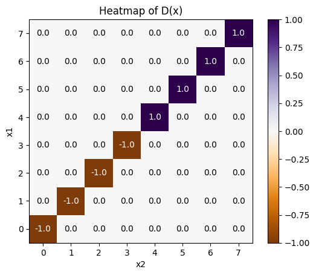
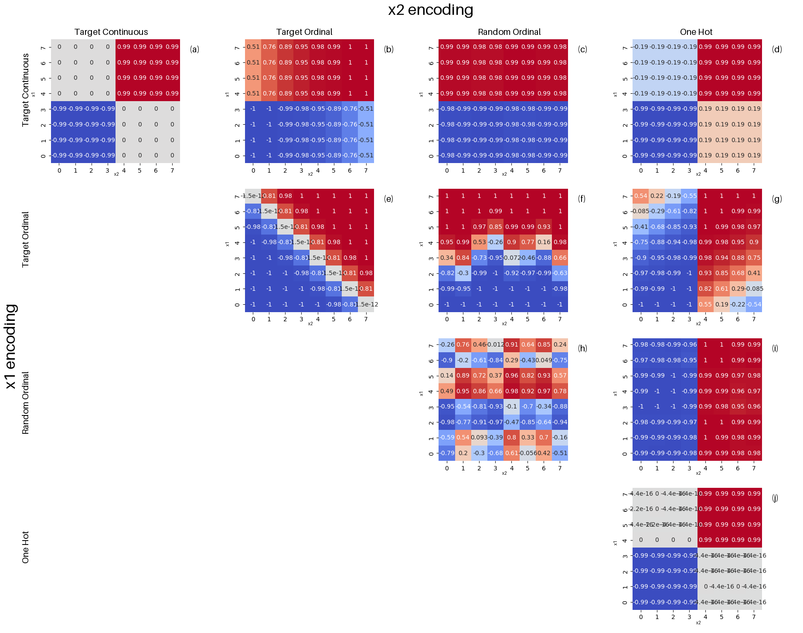
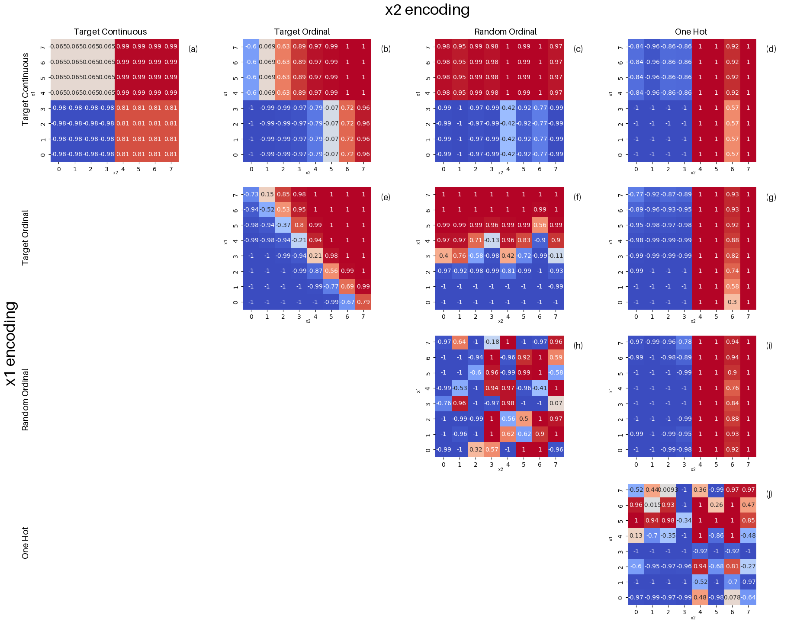
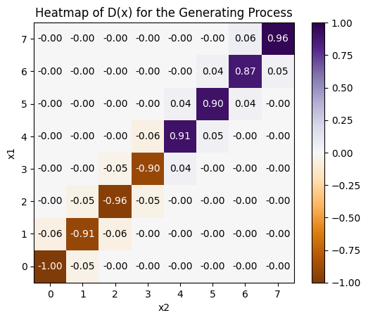

# Encoding Matters: Impact of Categorical Variable Encoding on Performance and Bias

[Paper linked here](Baylearn2024pdf.pdf)

## Metric Calculation

The method uses out-of-domain test samples uniformly sampled among input-groups. For domains including a relatively modest number of input-groups (e.g. 2 variables times 8 levels yield 64 input-groups), we use one representative of each input-group as out-of-domain test set.

We compute $\hat{P}(y|x)$ (reference predictions) and $\hat{P}_i(y|x)$ obtained by "neutralizing" the effect of variable $x_i$ by randomly permuting values assigned to $x_i$. Then we compute  $mean(abs(\hat{P}(y|x)-\hat{P}_i(y|x)))$, where the mean runs over all out-of-domain test samples, to measure the difference between predictions. We then average over multiple random permutations of assignment of values to $x_i$ to eliminate the chance factor and approximate the expected value to get $c_i=E(mean(abs(\hat{P}(y|x)-\hat{P}_i(y|x))))$.

In our numerical experiments, to simplify, we focus on only two variables $x_1$ and $x_2$ and encode them with one of several encoding methods (\eg, label encoding, target encoding, one-hot encoding). We fix the model used to obtain $\hat{P}(y|x)$ (\eg, a RBF SVM, a linear model, a neural network, or a Random Forest, with default parameter settings). For each combination of encoding, we evaluate the relative predictive importance of the two variables under study $R=c_1/c_2$, where $c_i$ is the predictive variable importance obtained by a permutation method described above. The relative predictive importance $R$ is usually influenced both by the statistical dependency between $x_1$,  $x_2$ and $y$ and by the "availability" of variables $x_1$ and $x_2$ to the given model. By "availability", we mean the ease with which the model exploits $x_1$ or $x_2$ to make predictions, which depends on variable encoding. Let us call $e_i$ the encodings of variables $x_1$ and  $x_2$ ($e_i\in$ {target encoding, target ordinal encoding, random ordinal encoding, one-hot encoding}). We compute $R(e_i, e_j)$ for each pair of encodings, $e_i$ encoding variable $x_1$ and $e_i$ variable $x_2$. We then compare values. 

Our first synthetic example has identical variables $x_1 = x_2$ and therefore both statistically dependent upon $y$. Hence $R$ solely depends on variable availability. If both variables are similarly encoded, we expect that $R(e_i, e_i)=1$. If $R(e_i, e_j)>1$ then it means the choice of encoding favors variable $x_1$ over $x_2$ while if $R(e_i, e_j)<1$, $x_2$ is favored over  $x_1$. In either case, $R(e_i, e_j)\neq 1$ indicates bias introduced by coding.

In the second synthetic example we consider the following data generating process: Draw $x_2 \in [0, 7]$, draw $x_1 = x_2  + \epsilon$, where $\epsilon$ is drawn according to a Normal distribution with standard deviation $\sigma=0.3$. Give value $y=0$ to points with value $x_2<4$ and $y=1$ otherwise. The causal graph is [ $x_1 = x_2  + \epsilon$] <- [$x_2$] ->    [$y=0$ if $x_2<4$; else $y=1$]
The relationship between $y$ and $x_2$ is deterministic, but that between $x_1$ and $x_2$ is noisy. $x_2$ is more predictive of $y$. Thus it seems natural that generalization according to $x_2$ would be privileged. Thus we should expect $R(e_i, e_j)<1$, that $x_2$ is favored.

In real data, the two variables are not identically dependent upon $y$. Hence $R(e_i, e_i)\neq 1$. The bias introduced by coding is revealed by the discrepancy between $R(e_i, e_i)$ and $R(e_i, e_j)$, $j\neq i$.

## Encoding types
All the following encoding types convert categorical data to numerical data. In the following definitions $x_i$ represents the feature to be encoded. $L_i$ represents the set of levels in $x_i$ and $l_{ij}$ represents a level within $L_i$

**Ordinal Encoding**:Given an ordering of $L_i$, ordinal encoding will return the position of that $l_{ij}$ within the order. Ex: order = [red, orange, yellow], encode([red, yellow, yellow]) = [0, 2, 2]

**Random Ordinal**: Ordinal encoding where the order is randomly assigned. This represents the case where there is a poor choice of the ordering.

**Target Ordinal**: Ordinal encoding scheme where the order is determined by the correlation of each level with the target. 

**Target Continuous**: Returns the mean of the target value $y$ such that each point has  $mean(y) : x_i = l_{ij}$. 

**OneHot**: Returns a vector of length $|L_i|$ where the $j$ th value is 1 and all other values are 0. 

# Synthetic Data

## Symmetric Features

### Dataset

Shows the plot of $D(x) = ( P(y=1|x) - P(y=0|x) ) p(x) / p_{max}  =  (2 P(y=1|x) -1) p(x) / p_{max}$. This dataset has identical $x_1$ and $x_2$ features such that $x_1 = x_2 = y$. A fair classifier should not prefer one feature other the other in predicting $y$.
Each feature has 8 possible values, numbered 0 to 7. The training data distribution is concentrated on diagonal locations in input space: $y=0: \mathbf{x} \in \{(0,0),(1,1),(2,2),(3,3)\}$; $y=1: \mathbf{x} \in \{(4,4),(5,5),(6,6),(7,7)\}$. Hence, generalization outside of such input space locations are guided by encoding bias. The dataset used in the following tests contains 1000 data points.

### Logistic Regression, Default Parameters

Classifier predictions  $2 P(y=1|\mathbf{x})-1$ are presented for *test data*. Each heatmap corresponds to a different combination of encoding of the two features $x_1$ and $x_2$. Heatmaps (a) (target encoding for both variables) and (j) (one-hot encoding for both variables)  presents an intuitive out-of-domain generalization (possibly acceptable, depending on the application domain):  $P(y=1|\mathbf{x})=0$, if $x_1 \leq 3,  x_2 \leq 3$, $P(y=1|\mathbf{x})=1$, if $x_1 > 3, x_2 >3$, $P(y=1|\mathbf{x})=0.5$ otherwise. This is the least biased case as this makes the least out-of-domain assumptions compared to others. Case (h) results in arbitrary generalization, governed by a random ordering of variable values. The off-diagonal cases are revealing of the asymmetry introduced by encoding, which facilitates generalizing along one of the dimensions. In particular, the heatmaps of the last column (d), (g), and (i), clearly show that one-hot encoding facilitates generalization. Hence, if one variable uses one-hot encoding (here $x_2$) and the other uses another encoding, then generalization is driven by the one-hot encoded variable: $P(y=1|\mathbf{x})<0.5$, if $x_2 \leq 3$, $P(y=1|\mathbf{x})>0.5$, if $x_2 >3$. While one-hot encoding "dominates" all other encodings, it does not strongly dominate target continuous encoding. Furthermore target continuous encoding dominates target-ordinal and random-ordinal and target-ordinal dominates random-ordinal. So, while encoding with on-hot encoding may seem preferable (because least biased), target encoding presents a good alternative, if one-hot encoding is not viable because of problems of curse-of-dimensionality.

$R(e_1,e_2)$:
|                         | TargetContinuous:x2 | TargetOrdinal:x2 | RandomOrdinal:x2 | OneHot:x2 |
| :---------------------- | :--------------- | :---------------------- | :---------------------- | :--------------- |
| TargetContinuous:x1        | -0.032181        | -1.76737                | -5.07958                | 0.362936         |
| TargetOrdinal:x1 | 1.74079          | -0.00151107             | -1.64611                | 0.879471         |
| RandomOrdinal:x1 | 6.02127          | 2.066                   | -0.561533               | 4.73425          |
| OneHot:x1        | -0.427298        | -0.907887               | -4.04687                | -0.032181        |

We can see that when random-ordinal encoding is used, the other feature always dominates. This is reflected by the negative values in the column for $x_2$ and the positive values in the row for $x_1$. We can also see that one-hot encoding dominates all other encoding types reflected by its positive column for $x_2$ and negative row for $x_1$. We also notice that the diagonal is close to zero where the encoding type is not random-ordinal encoding. A value of zero indicates no preference of variables. The non-zero value for $e_1,e_2 =$ random-ordinal encoding results from the models inability to fit the training data resulting in a randomized preference. The quantitative results of $R(e_1,e_2)$ align with the previous figure. 

### Neural Network, $\alpha = 10$

Classifier predictions  $2 P(y=1|\mathbf{x})-1$ are presented for *test data*. Heatmap (j) is the least biased where the model as the model does not prefer one variable over the other. The results show that generalizations utilizing random-ordinal encoding are the most the biased, having a clear preference for the feature encoded using the alternate strategy. An artifact of ordinal encoding appears in cases (b) and (g). The nature of ordinal encoding is such that each successive level increases the input by 1. Thus for (b), horizontally there is a gradient where $x_2=0$ has the lowest $2 P(y=1|\mathbf{x})-1$ value for $x_1 > 4$ and the highest values for $x_2=7$ and $x_1 < 4$. Additionally for (g) and (f), vertically there is a gradient. For (g), the graident is most visible for $x_2=0$ and $x_2 = 7$. This effect is also seen in case (e), however, since both features are encoded ordinally the gradient is diagonal. In all of the off diagonal heatmaps there are preferences towards one feature. One-hot encoding dominates all of its off diagonal pairs target-ordinal encoding dominates all that are not one-hot encoding and target-ordinal encoding dominates random-ordinal.

$R(e_1,e_2)$:
|                         | TargetContinuous:x2 | TargetOrdinal:x2 | RandomOrdinal:x2 | OneHot:x2 |
| :---------------------- | :--------------- | :---------------------- | :---------------------- | :--------------- |
| TargetContinuous:x1        | 0.24091          | -0.779869               | -3.80423                | 0.44286          |
| TargetOrdinal:x1 | 1.08786          | 0.195335                | -0.484428               | 0.791486         |
| RandomOrdinal:x1 | 4.92722          | 2.30064                 | 0.193524                | 2.84085          |
| OneHot:x1        | -0.387975        | -0.792507               | -3.33748                | -0.0717689       |

For the off diagonal results, we can see that when random-ordinal encoding is used, the other feature always dominates. This is reflected once agin by the negative values in the column for $x_2$ and the positive values in the row for $x_1$. We can also see that one-hot encoding dominates all other encoding types reflected by its positive column for $x_2$ and negative row for $x_1$. We also notice that the diagonal is small but much larger than the previous quantitative results. This indicates that the neural network tends to make more random out-of-domain generalizations than does logistic regression.

### Neural Network, No regularization

We once agin show the classifier predictions  $2 P(y=1|\mathbf{x})-1$ for *test data*. Heatmaps (d), (g), and (i) show
a very strong preference for one-hot encoding reflected by the vertical split. Heatmaps (c), (f) show a preference away from random-ordinal encoding. We see in (h) that the neural network is able to fit the in-domain data on the diagonal but struggles in generalizing. (b) shows a preference of target-continuous compared to target ordinal as well as showing the gradient of ordinal encoding as previously discussed. We see random preferences in (a) and (j) indicating that the lack of regularization leads to increased out-of-domain generalizations. 

$R(e_1,e_2)$:
|                         | TargetContinuous:x2 | TargetOrdinal:x2 | RandomOrdinal:x2 | OneHot:x2 |
| :---------------------- | :--------------- | :---------------------- | :---------------------- | :--------------- |
| TargetContinuous:x1        | 0.764156         | 0.247328                | -4.57222                | 2.90733          |
| TargetOrdinal:x1 | 0.922938         | 0.370938                | -0.641183               | 2.99676          |
| RandomOrdinal:x1 | 6.08493          | 1.04696                 | -0.844642               | 6.46482          |
| OneHot:x1        | -1.67252         | -0.808272               | -5.67367                | -0.156863        |

We see the same pattern as before with the column of random-ordinal encoding being negative for all off diagonal values column-wise and positive for all off diagonal values row-wise. This is inverted for one-hot where all off diagonal column-wise values are positive and off diagonal row values are negative. We see all diagonal values are quite large compared to the previous quantitative results, this indicates that lower regularization and higher complexity results in more arbitrary generalizations. 

## Asymmetric Features

### Dataset

Data Generation Process: Draw $x_2 \in [0, 7]$, draw $x_1 = x_2  + \epsilon$, where $\epsilon$ is drawn according to a Normal distribution with standard deviation $\sigma=0.3$. Give value $y=0$ to points with value $x_2<4$ and $y=1$ otherwise. The causal graph is [ $x_1 = x_2  + \epsilon$] <- [$x_2$] ->    [$y=0$ if $x_2<4$; else $y=1$]. 10000 points are sampled to generate the dataset.

The plot shows: $D(x) = ( P(y=1|x) - P(y=0|x) ) p(x) / p_{max}  =  (2 P(y=1|x) -1) p(x) / p_{max}$

The relationship between $y$ and $x_2$ is deterministic, but that between $x_1$ and $x_2$ is noisy. $x_2$ is more predictive of $y$. Thus it seems natural that generalization according to $x_2$ would be privileged. 

### Logistic Regression, High L1

Here we trained a logistic regression model with high L1 regularization to try and isolate the more predictive feature. The expectation as previously stated is that $x_2$ is perfectly predictive whereas $x_1$ has a noisy relationship. Thus, we expect to see the model have a vertical line splitting $y$ based on solely $x_2$. 

For (a), (e), (i), (j), we see this vertical split and to a lesser extent (h). However, for every other heatmap this does not appear to be the case. This indicates that we can change direction of generalization using only the features' encodings.

# Real Data

## Adult Income Dataset
The Adult dataset, which contains features such as race and education, is used to study the impact of encoding choices in a real-world scenario. Features are preprocessed and encoded using Target Encoding, Target Ordinal Encoding, Ordinal Encoding, and One-Hot Encoding. The model is trained on the preprocessed data, and the performance of different encoding strategies is evaluated using mean squared differences and ratios, similar to the synthetic example.

### Neural Network
Hidden Layers: \[5,5\], $\alpha=1$

#### $R(e_1,e_2)$:
|                           | TargetContinuous:education | TargetOrdinal:education | OrdinalEncoder:education | OneHot:education |
| :------------------------ | :---------------------- | :----------------------------- | :----------------------- | :---------------------- |
| TargetContinuous:race        | 1.80761                 | 0.378853                       | 0.288799                 | 1.69363                 |
| TargetOrdinal:race | 1.94494                 | 0.606847                       | 0.597614                 | 1.87873                 |
| OrdinalEncoder:race       | 1.74858                 | 0.575731                       | 0.448224                 | 1.68562                 |
| OneHot:race        | 1.64214                 | 0.373556                       | 0.317833                 | 1.81385                 |

#### Balanced Accuracy (in-domain test data):

|                           | TargetContinuous:education | TargetOrdinal:education | OrdinalEncoder:education | OneHot:education |
| :------------------------ | :---------------------- | :----------------------------- | :----------------------- | :---------------------- |
| TargetContinuous:race        | 0.584902                | 0.5                            | 0.5                      | 0.584902                |
| TargetOrdinal:race | 0.584754                | 0.5                            | 0.5                      | 0.584902                |
| OrdinalEncoder:race       | 0.580292                | 0.5                            | 0.5                      | 0.580292                |
| OneHot:race        | 0.584902                | 0.5                            | 0.5                      | 0.580441                |

#### Analysis

The $R$ values in the first grid give an idea of how much education dominates race. We would expect that the value of $R$ be very high as income is far more dependent on education than race. We see from the results that the $R$ values when education is encoded ordinally is significantly reduced compared to when its encoded using target continuous or one-hot encoding. We also notice that the balanced accuracy collapses to 50%. There is a clear effect of ordinal encoding making the input space harder to learn for the neural network.

### Neural Net - Feature Sets

$f_1 =$ [race, gender, workclass]
$f_2 =$ [marital-status, age, occupation]

|                | OneHot:f1 | TargetContinuous:f1 | OrdinalEncoder:f1 |
|----------------|------------------|------------------|-------------------|
| OneHot:f2 | 0.714410         | 0.739437         | 0.199159          |
| TargetContinuous:f2 | 1.518820         | 1.101716         | 0.688299          |
| OrdinalEncoder:f2 | 1.742374         | 1.233398         | 1.076349          |

#### Analysis 

Table of the $R$ values for feature sets $f_1$ and $f_2$ each containing 3 distinct features. The calculation of $R$ remain the same with the the permutation being applied to all features in $f_i$. Overall we can observe that all of the $R$ values are positive indicating that the features in $f_1$ are used more in predicting income than $f_2$. We also see further evidence that One-Hot encoding is the "easiest" for models to learn from and ordinal encoding is the hardest. We see that when $f_2$ is encoded using One-Hot encoding there are the lowest values out of any other row and therefore the most preference for $f_2$. Conversely, when $f_2$ is ordinally encoded we see the least preference for $f_2$. We see a similar case for the columns. Where $f_1$ uses One-Hot encoding there are the highest values compared to the other columns. Where $f_1$ is encoded ordinally, we see the lowest values or the least preference for $f_1$ features. We can also examine the smallest $R$ value and the largest $R$ value which are mirrored positions in the table. 1.74 (OneHot:$f_1$, OrdinalEncoder:$f_2$) is the highest value and the most preference for $f_1$, whereas, 0.12 (OrdinalEncoder:$f_1$, OneHot:f2) is the lowest value and the most preference for $f_2$. Based on this evidence it seems as if one-hot encoding "pulls" the generalization in its favor, whereas, ordinal encoding "pushes" the generalization away. 

## Cook County Sentencing

Here we look at the two input features commitment type and race in predicting the sentencing outcome using 266435 datapoints. Here sentencing type can be determined perfectly solely using commitment type. Sentencing decisions are grouped versions of commitment type. Therefore any usage of race in generalization is incorrect. 

### Logistic Regression, Default

#### $R(e_1,e_2)$:

|                           | TargetContinuous:COMMITMENT_TYPE | TargetOrdinal:COMMITMENT_TYPE | OrdinalEncoder:COMMITMENT_TYPE | OneHot:COMMITMENT_TYPE |
| :------------------------ | :---------------------------- | :----------------------------------- | :----------------------------- | :---------------------------- |
| TargetContinuous:RACE        | 3.617903                      | 2.144558                             | 2.118536                       | 2.958105                      |
| TargetOrdinal:RACE | 4.496680                      | 3.150707                             | 3.073897                       | 3.839763                      |
| OrdinalEncoder:RACE       | 3.818604                      | 2.525171                             | 2.370728                       | 3.174911                      |
| OneHot:RACE        | 3.055226                      | 1.509424                             | 1.274146                       | 2.819895                      |

#### Balanced Accuracy (in-domain test data):

|                           | TargetContinuous:COMMITMENT_TYPE | TargetOrdinal:COMMITMENT_TYPE | OrdinalEncoder:COMMITMENT_TYPE | OneHot:COMMITMENT_TYPE |
| :------------------------ | :---------------------------- | :----------------------------------- | :----------------------------- | :---------------------------- |
| TargetContinuous:RACE        | 0.996685                      | 0.996612                             | 0.982144                       | 0.996685                      |
| TargetOrdinal:RACE | 0.996685                      | 0.996612                             | 0.982144                       | 0.996685                      |
| OrdinalEncoder:RACE       | 0.996685                      | 0.996612                             | 0.981992                       | 0.996685                      |
| OneHot:RACE        | 0.996685                      | 0.996612                             | 0.982107                       | 0.996685                      |

#### Analysis
Tables showing both $R$ values on equal weighted group test data and balanced accuracy on in-domain dest data. In these tables see similar patterns emerge to the previous evidence. Commitment type is the only useful feature in predicting the sentencing outcome. This should mean we see large positive $R$ values. However, when commitment type is ordinally encoded the model uses this feature less during out of domain generalization than if it were encoded using One-Hot encoding or Target Encoding. This shows once again that encoding type affects the usage of the features under out of domain generalization. We see that when we use ordinal encoding (default sklearn `OrdinalEncoder`) we see that there is the lowest balanced accuracy. This make the observations above trivially obvious saying that it performs poorly in domain so it will perform badly out of domain as well. This becomes less trivial when we observe the case of commitment type using target ordinal encoding. In this case, there is an extremely small decrease in the balanced accuracy likely too small for any statistical difference (0.000073). In this case the model performs nearly equally as well in domain using target ordinal encoding as target encoding for commitment type. Additionally, there is no change to in domain performance when we vary the encoding type of race unless commitment type is encoded using the default ordinal encoding. Using the $R$ values from the table above shows us that the model can have exactly the same in domain performance while relying more or less on certain features in out of domain generalization.  

# Neural Network
Hidden Layers: \[5,5\], Alpha=1

#### $R(e_1,e_2)$:

|                           | TargetContinuous:COMMITMENT_TYPE | TargetOrdinal:COMMITMENT_TYPE | OrdinalEncoder:COMMITMENT_TYPE | OneHot:COMMITMENT_TYPE |
| :------------------------ | :---------------------------- | :----------------------------------- | :----------------------------- | :---------------------------- |
| TargetContinuous:RACE        | 3.985657                      | 2.267989                             | 7.196144                       | 3.614776                      |
| TargetOrdinal:RACE | 4.647600                      | 3.303791                             | 9.321657                       | 5.020746                      |
| OrdinalEncoder:RACE       | 3.735236                      | 2.547301                             | 7.212207                       | 3.195534                      |
| OneHot:RACE        | 3.283287                      | 2.449550                             | 0.525701                       | 2.913817                      |

#### Balanced Accuracy (in-domain test data):

|                           | TargetContinuous:COMMITMENT_TYPE | TargetOrdinal:COMMITMENT_TYPE | OrdinalEncoder:COMMITMENT_TYPE | OneHot:COMMITMENT_TYPE |
| :------------------------ | :---------------------------- | :----------------------------------- | :----------------------------- | :---------------------------- |
| TargetContinuous:RACE        | 0.996685                      | 0.996612                             | 0.986852                       | 0.996876                      |
| TargetOrdinal:RACE | 0.996685                      | 0.996731                             | 0.986852                       | 0.996952                      |
| OrdinalEncoder:RACE       | 0.996685                      | 0.996764                             | 0.986852                       | 0.996647                      |
| OneHot:RACE        | 0.996685                      | 0.996688                             | 0.986701                       | 0.996647                      |

#### Analysis
Tables showing both $R$ values on equal weighted group test data and balanced accuracy on in-domain dest data. In the first table, we see more drastic variations in the $R$ values compared to the last tables where the default encoding the commitment type has the highest $R$ values unless race is encoded using One-Hot encoding (where we have the lowest $R$ value of 0.53). For the balanced accuracy of commitment type using default ordinal encoding, the accuracies are similar regardless of how race is encoded and the resulting $R$ value. Additionally, this column once again has the lowest balanced accuracy scores of any other column where every other column has very similar accuracy scores. We notice again the pattern where the balanced accuracy of the commitment type being encoded using target encoded is very similar. However, this column has lower $R$ values than that of all other columns. Both show that in-domain performance metrics are not enough to tell us about how the model generalizes and if it is inducing bias for features that didn't otherwise exist. 

<!--
## Encoded Spaces
## Random Ordinal
## Target Ordinal
## Target Encoding -->
